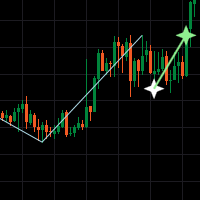
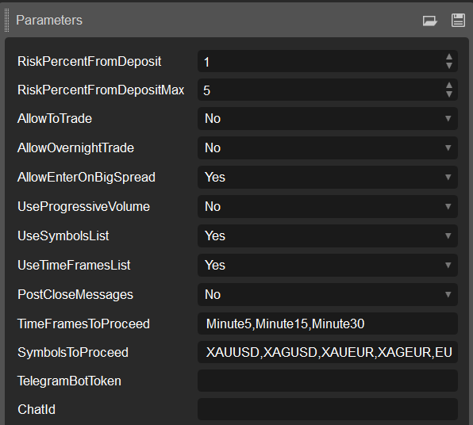
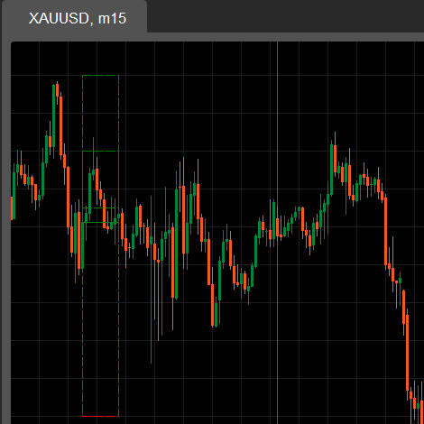
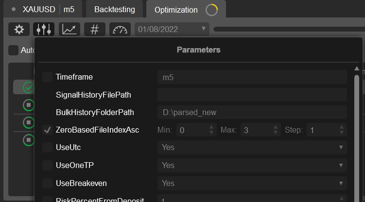
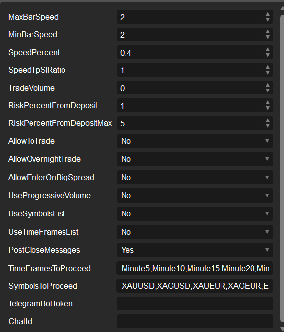
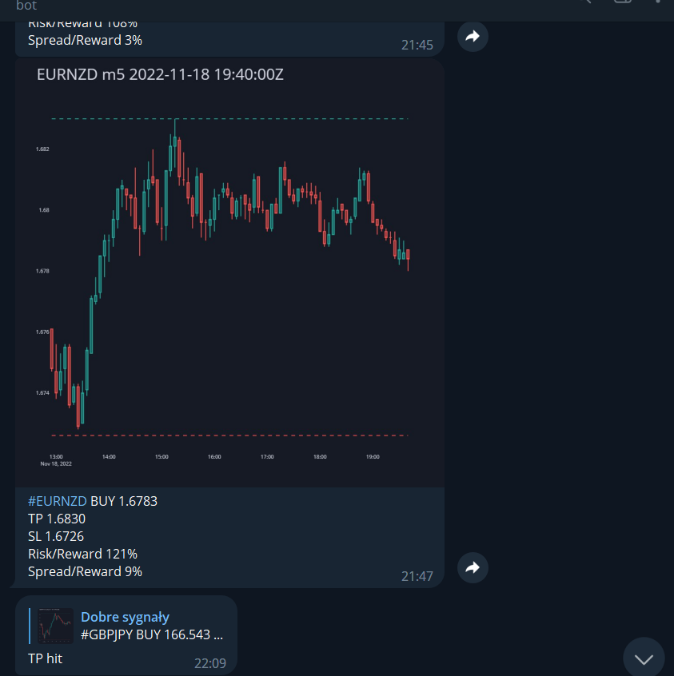

# cTrader bots & indicators
Can be easily connected to your cTrader terminal.
1. Build the project you need.
2. Get the indicator or bot `/bin/Release/net6.0/<bot_project_name>.algo`.
3. Place it to `/cAlgo/Sources/Indicators` or `/cAlgo/Sources/Robots`.
4. Find it in cTrader and connect to a chart/backtesting/real trading
5. ???
6. PROFIT!

## Elliott Wave Impulse Trading System (bot & indicator)
- indicator `ImpulseFinderIndicator.csproj`

    

- bot `ImpulseSignalerBot.csproj`

    

## Signals checker bot & indicator
- indicator `SignalsCheckIndicator.csproj`

    

- bot `SignalCheckerBot.csproj`

    

## Rate-based bot
- bot `RateSignalerBot.csproj`

    

## Telegram reporting

