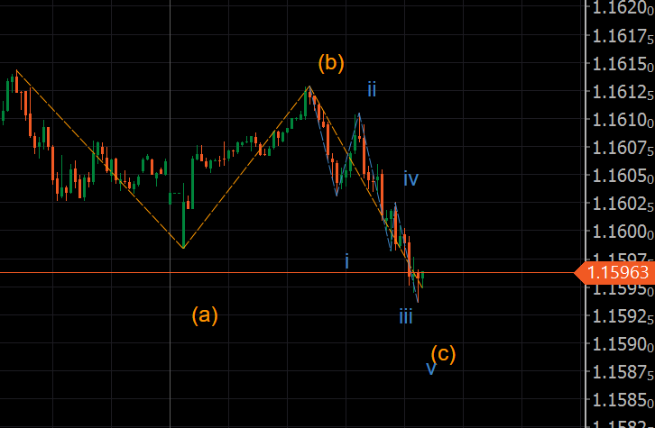

# Elliott Wave Auto-Markup & Price Prediction

Automated Elliott Wave analysis indicator for cTrader. Identifies wave models on live charts, matches partial (incomplete) structures, and projects price targets for the next waves using Fibonacci ratios and trendline convergence.

## Key features

- **Full auto-markup** — recursive identification of impulses, zigzags, flats, triangles, and diagonals up to configurable depth.
- **Partial model matching** — recognizes incomplete structures (missing 1–2 trailing waves) and competes them against full models by adjusted score.
- **Price projections** — Fibonacci-based target levels for active/upcoming waves with trendline intersection for triangles and diagonals.
- **Cluster zones** — highlights price areas where multiple projections converge (≤ 5 % tolerance).

## Quick start

1. Build `ElliottIndicator.csproj` (or `ImpulseFinderIndicator.csproj` for the classic setup-finder).
2. Copy the resulting `.algo` file to `cAlgo/Sources/Indicators`.
3. Attach to a chart — the indicator auto-detects zigzag structure and displays markup + projections.

## Other indicators & bots

| Project | Description |
|---------|-------------|
| `ImpulseFinderIndicator` / `ImpulseSignalerBot` | Finds initial impulse (wave 1/A) and signals the pullback trade. |
| `GartleyFinderIndicator` / `GartleySignalerBot` | Gartley harmonic patterns + MACD divergence filter. |
| `PriceActionIndicator` / `PriceActionSignalerBot` | Classic price-action pattern detector. |
| `SignalsCheckIndicator` / `SignalCheckerBot` | Validates external signals against chart structure. |
| `RateSignalerBot` | Rate-of-change based alerting bot. |
| `SignalForwarder` | Forwards Telegram signals between channels. |

All bots support Telegram reporting for trade alerts.

